# Lead Scoring / Conversion Prediction

A business-first machine learning project that predicts lead conversion probability, calibrates predicted scores, ranks leads for outreach, and converts model outputs into a practical contact strategy.

## Why this project exists

Sales and business development teams usually cannot contact every lead with the same intensity.  
The goal of this project is to answer a realistic business question:

> Which leads should we contact first if our outreach capacity is limited?

Instead of stopping at model training, this project goes end-to-end:
- frames the business problem clearly
- removes target leakage
- performs EDA
- builds a baseline model
- improves it with a stronger model
- calibrates probabilities
- ranks leads by score
- recommends which top percentage of leads to contact
- saves the final model artifact
- includes a lightweight scoring app

---

## Business problem

A call-center / outbound sales team wants to maximize conversions while controlling contact costs.

The operational objective is not just to classify leads as likely or unlikely to convert.  
It is to:

1. estimate conversion probability accurately
2. rank leads by predicted propensity
3. contact the highest-value leads first
4. translate model output into a measurable business policy

This is why probability calibration and threshold-based decisioning are part of the project.

---

## Dataset

**Source:** UCI Bank Marketing Dataset  
**File used:** `bank-additional-full.csv`

The original problem is whether a customer subscribes to a term deposit after marketing outreach.  
For portfolio purposes, I frame it as a **lead scoring / conversion propensity** use case.

### Why this dataset is a strong proxy for lead scoring
- real marketing conversion problem
- enough rows to feel realistic
- mixed numeric + categorical features
- suitable for ranking and prioritization
- includes a real leakage risk that must be handled carefully

---

## Leakage handling

A key modeling decision in this project is the removal of:

- `duration`

This field represents the duration of the last contact.  
That value is not available before the call happens, so using it in a pre-contact model would leak post-contact information and inflate performance unrealistically.

This makes the project much more credible from a real-world ML perspective.

---

## Repository structure

```text
lead-scoring-conversion-prediction/
├── README.md
├── LICENSE
├── .gitignore
├── requirements.txt
├── app/
│   └── streamlit_app.py
├── data/
│   ├── raw/
│   └── processed/
├── models/
├── predictions/
├── reports/
│   └── figures/
└── src/
    ├── business.py
    ├── config.py
    ├── data.py
    ├── download_data.py
    ├── eda.py
    ├── evaluate.py
    ├── features.py
    ├── modeling.py
    ├── predict.py
    └── train.py
```
---

## Key outputs and screenshots

### 1. Target distribution
This shows the dataset is imbalanced, which is why ranking metrics and calibration matter more than plain accuracy.

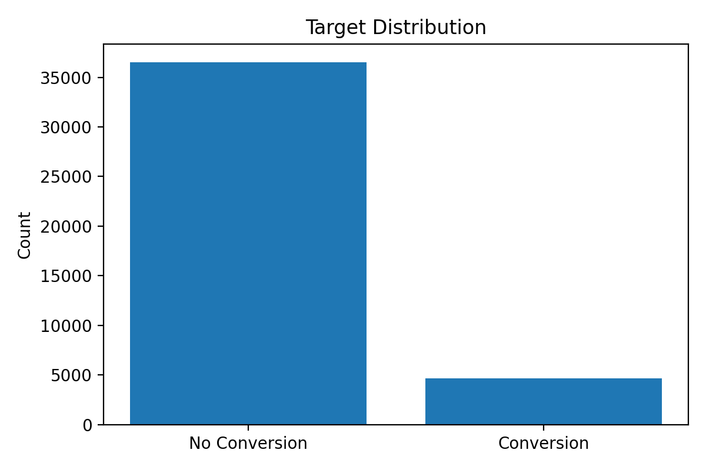

---

### 2. Monthly conversion trend
This helps show seasonality and business timing effects in conversion behavior.

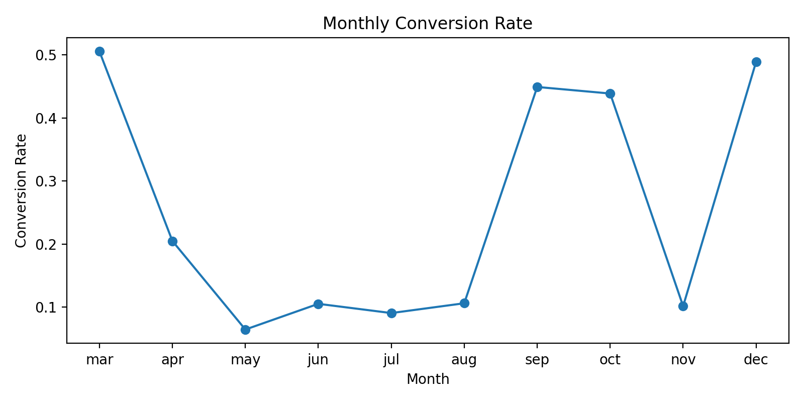

---

### 3. Conversion rate by contact type
A simple business-facing EDA view to compare conversion differences across outreach channels.

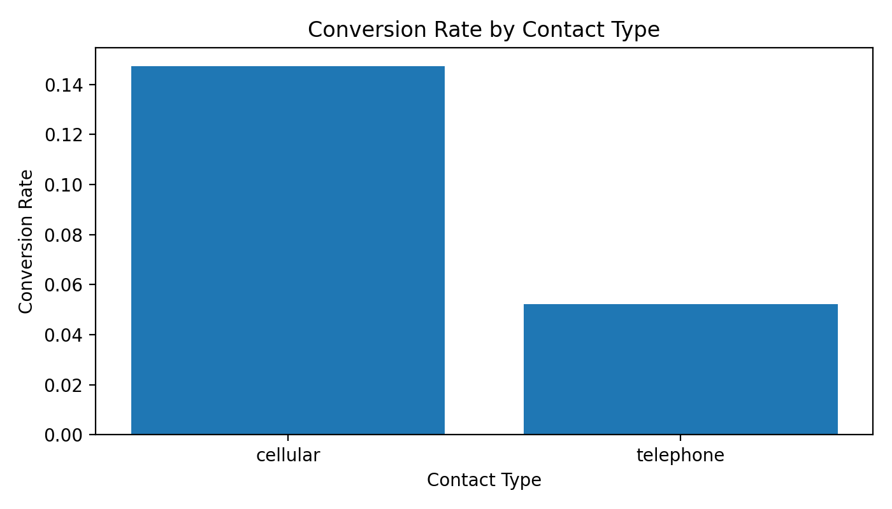

---

### 4. Validation model comparison
Comparison of baseline logistic regression, tuned random forest, and calibrated random forest on validation data.

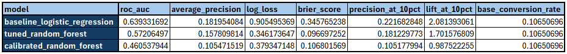

**Artifact:** [validation_model_comparison.csv](reports/validation_model_comparison.csv)

---

### 5. Precision-Recall curve
A better evaluation view than accuracy for imbalanced conversion prediction problems.

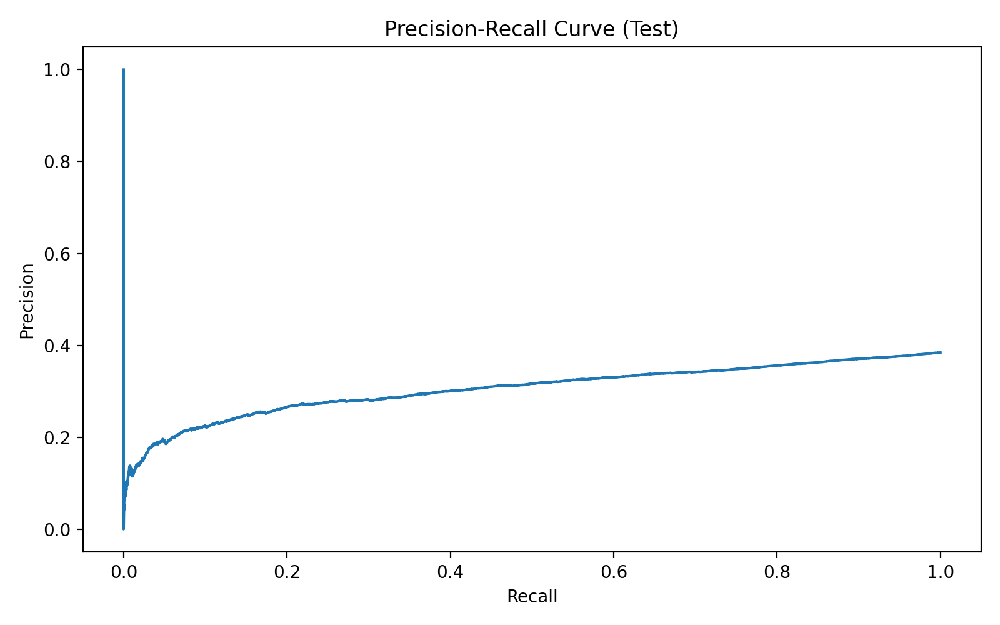

---

### 6. Calibration curve
This shows whether predicted probabilities are reliable enough for lead ranking and business thresholding.

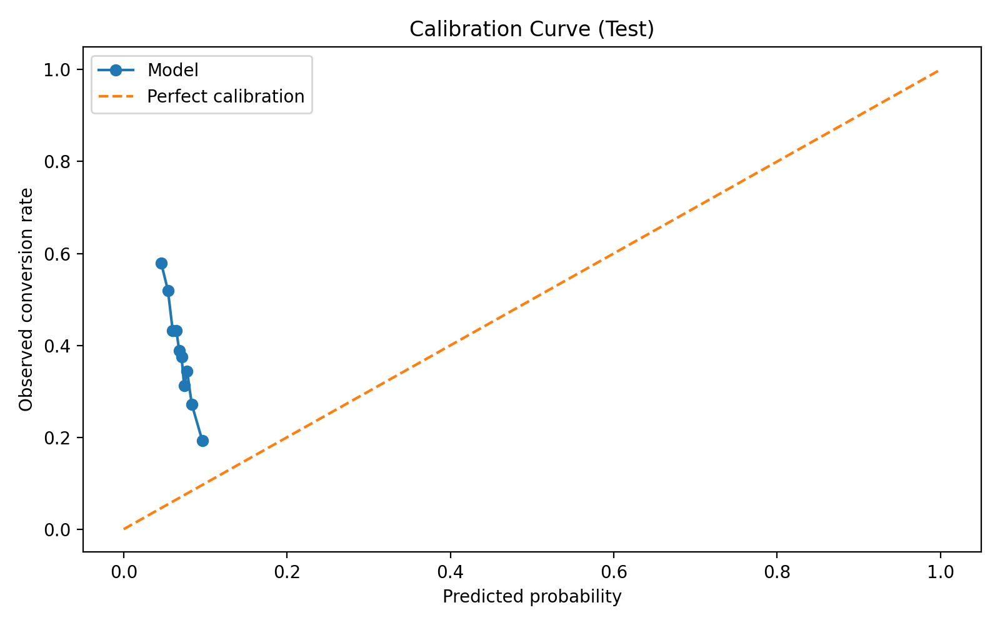

---

### 7. Score distribution
Predicted score separation between converted and non-converted leads.

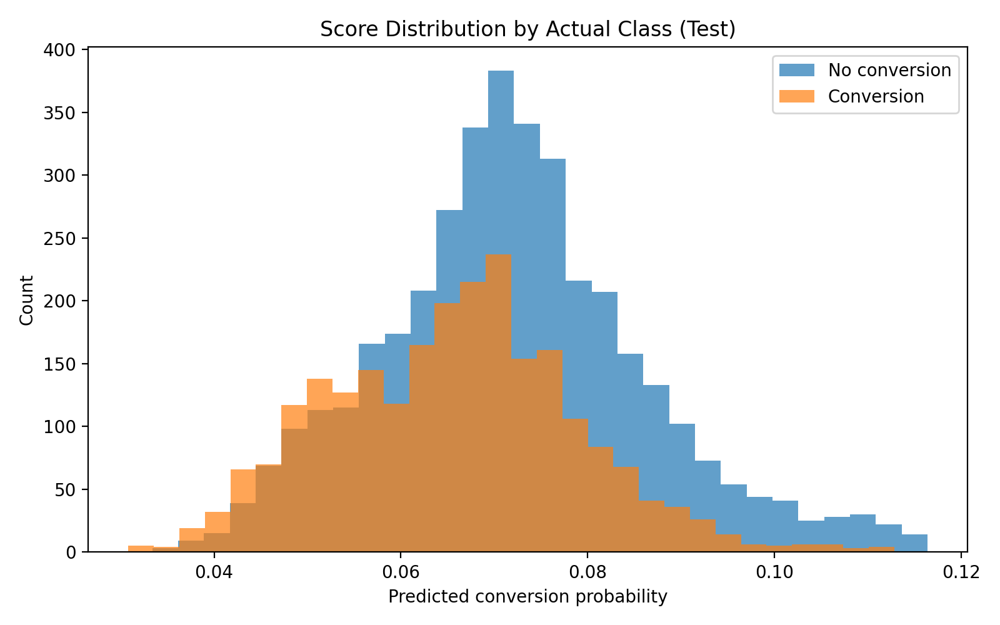

---

### 8. Feature importance
Permutation importance used to explain which variables most influenced model performance.

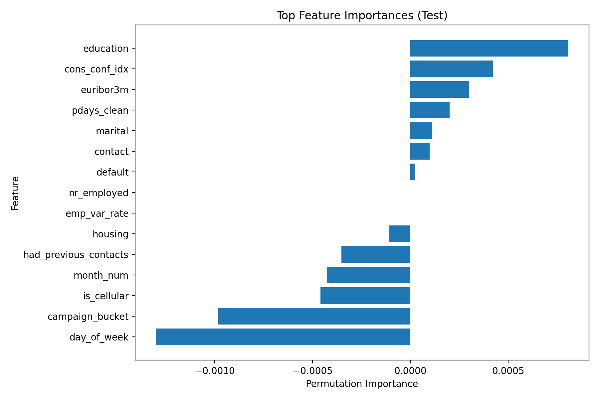

**Artifact:** [test_feature_importance.csv](reports/test_feature_importance.csv)

---

### 9. Gain curve
This is one of the most business-useful views in the project because it shows how many conversions are captured by contacting the highest-ranked leads first.

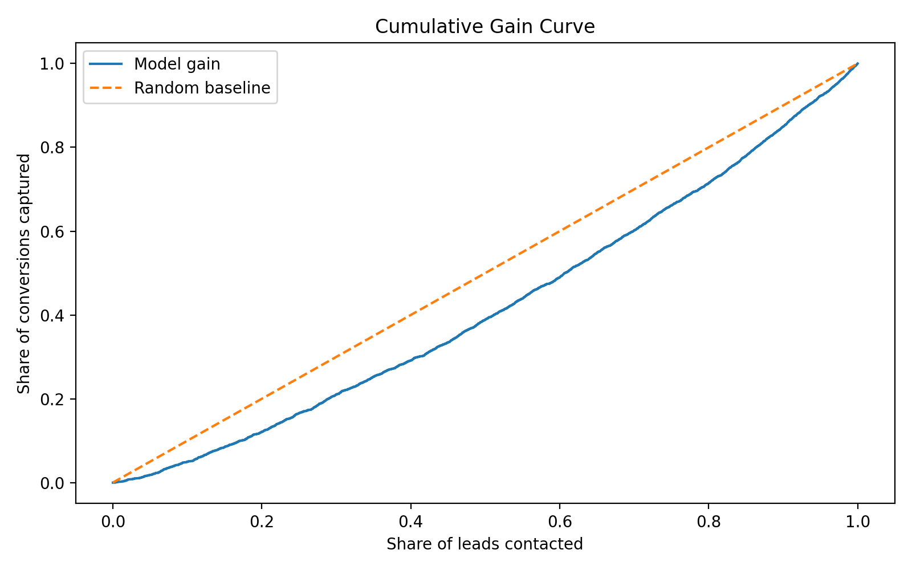

---

### 10. Validation contact policy table
This table shows the business decision layer: which top share of leads should be contacted based on expected performance.

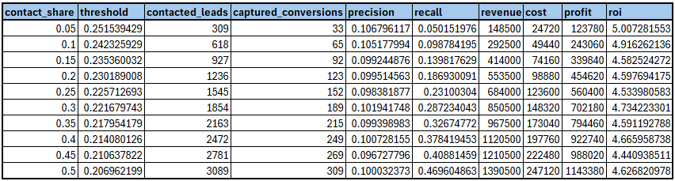

**Artifact:** [validation_contact_policy.csv](reports/validation_contact_policy.csv)

---

### 11. Scored leads sample
Example of ranked output with lead scores, ranks, and contact recommendation flags.

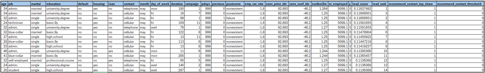

**Artifacts:**  
[test_scored_leads.csv](predictions/test_scored_leads.csv)  
[streamlit_scored_leads.csv](predictions/streamlit_scored_leads.csv)

---

### 12. Streamlit app demo
A lightweight app for uploading leads and generating ranked lead scores.

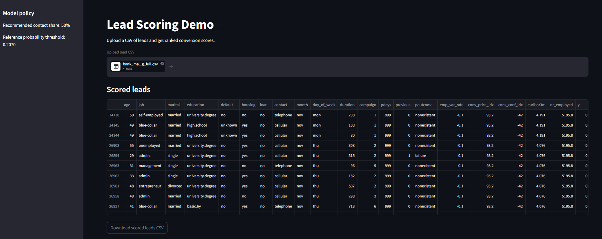

---

## Key artifacts

- [EDA summary](reports/eda_summary.json)
- [Unknown value share report](reports/unknown_value_share.csv)
- [Training summary](reports/training_summary.json)
- [Validation model comparison](reports/validation_model_comparison.csv)
- [Validation contact policy](reports/validation_contact_policy.csv)
- [Test metrics](reports/test_metrics.json)
- [Test contact policy](reports/test_contact_policy.csv)
- [Test feature importance](reports/test_feature_importance.csv)
- [Sample scored leads](predictions/sample_scored_leads.csv)
- [Test scored leads](predictions/test_scored_leads.csv)
- [Streamlit scored leads](predictions/streamlit_scored_leads.csv)